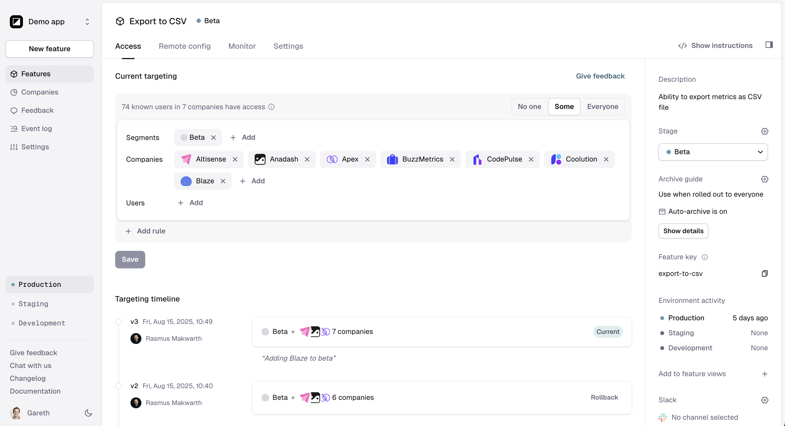
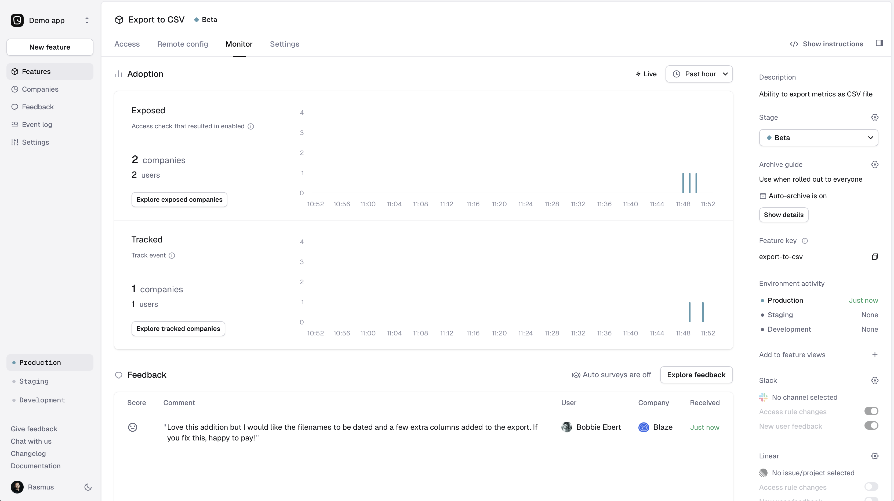

# Getting started

**Welcome!** Let's get started. We'll do the following:

1. Create your first flag.
2. Install the Reflag SDK.
3. Set flag access rules and/or remote config.
4. Enable Toolbar for local testing
5. Monitor your flag launch.

## 1. Create your first flag

Now let's create your first flag.



```
npx @reflag/cli new
```

See [CLI docs](sdk/documents/cli/).



1. [Sign up](https://app.reflag.com/) in the app
2. Click `New flag` in the sidebar.
3. Give your flag a name, and we'll suggest a `flag key`.

<figure><figcaption></figcaption></figure>



You can create flags from your code editor via our [MCP](api/mcp.md).



You can create flags from within Linear by mentioning the `@reflag` [agent](integrations/linear.md).



Next, let's set up a Reflag SDK for your language and framework.

## 2. Install the Reflag SDK

Find the supported languages below:



### Code example for React

If you've installed the React SDK and created a flag called `my-new-flag`, getting started looks like this:

```jsx
import { useFlag } from "@reflag/react-sdk";

const MyFlag = () => {
  const { isEnabled } = useFlag("my-new-flag");

  return isEnabled ? "You have access!" : null;
};
```

You can now use `isEnabled` to gate access to the flag.

## 3. Set access rules

Head back to [your dashboard](https://app.reflag.com/), select your flag, and open the `Access` tab.

<figure><figcaption></figcaption></figure>

From here, you can define segments, companies, and users that will access your flag.

## 4. Enable Toolbar for local testing <a href="#next-steps-1" id="next-steps-1"></a>

In the frontend SDK, enable the Toolbar to toggle flags locally.

<figure><figcaption></figcaption></figure>

In the React SDK, you enable it with `toolbar:`

```jsx
<ReflagProvider
   publishableKey=""
   context={}
   toolbar={true}
>
```

## 5. Monitor your flag launch <a href="#next-steps-1" id="next-steps-1"></a>

On the Monitor tab, you can track real-time flag exposure, adoption, and user feedback.

<figure><figcaption></figcaption></figure>

### Track exposure

The Exposed chart shows companies that have been exposed to your flag. This means they were checked for flag access against your targeting rules and the check returned `enabled`.

### Track adoption

To track whether exposed companies are also interacting with your flag, use `track`.

See the code example below.

### Get user feedback

To get feedback from your users, you can add a [static "Feedback" button](product-handbook/launch-monitor/#static-feedback-button) or you can [trigger a survey](product-handbook/launch-monitor/automated-feedback-surveys.md), at the right time.

Here's an example with a static feedback button.

```tsx
import { useFlag } from "@reflag/react-sdk";

const MyFlag = () => {
  const { isEnabled, track, requestFeedback } = useFlag("my-new-flag");

  if (!isEnabled) {
    return null;
  }

  return (
    <>
      <button onClick={() => track()}>Try it</button>
      <button
        onClick={() => requestFeedback({ title: "How do you like this new release?" })}
      >
        Give feedback
      </button>
    </>
  );
}
```

## Get support

* Need some help? [Chat with us](mailto:hello@reflag.com)
* Latest product updates? [See Changelog](https://reflag.com/changelog)
* Create account: [Sign up](https://app.reflag.com/)
