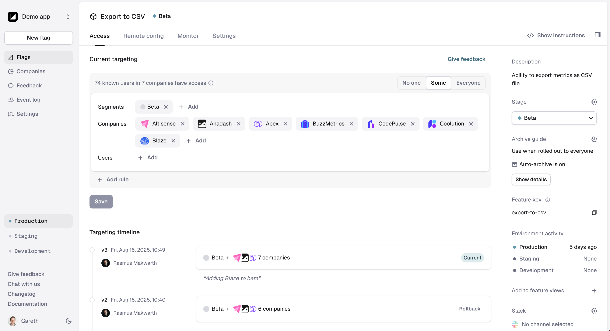

# Getting started

**Welcome!** Let's get started. We'll do the following:\


1. Create your first feature flag
2. Install the Reflag SDK
3. Set feature access rules and/or remote configuration
4. Monitor your feature launch

## 1. Create your first feature&#x20;

Now let's create your first feature.&#x20;



```
npx @reflag/cli new
```

See [CLI docs](sdk/documents/cli/README.md).



1. [Sign up](https://app.reflag.com/) in the app
2. Click `New feature` in the sidebar.
3. Give your feature a name, and we'll suggest a `feature key` .

<figure><figcaption></figcaption></figure>



You can create features from your code editor via our [MCP](api/mcp.md).



You can create features from within Linear by mentioning the `@reflag` [agent](integrations/linear.md).




Next, let's set up a Reflag SDK for your language and framework.

## 2. Install the Reflag SDK

Find the supported languages below:



### Code example for React

If you've installed the React SDK and have created a feature called `my-new-feature`, getting started will look like the following:

```jsx
import { useFlag } from "@reflag/react-sdk";

const MyFeature = () => {
  const { isEnabled } = useFlag("my-new-feature");

  return isEnabled ? "You have access!" : null;
};
```

You can now use `isEnabled` to gate access to the feature.&#x20;

## 3. Set access rules

Head back over to [your dashboard](https://app.reflag.com/), select your feature and the `Access` tab.

<figure><figcaption></figcaption></figure>

From here, you can define segments, companies, and users that will access your feature.

## 4. Monitor your feature launch <a href="#next-steps-1" id="next-steps-1"></a>

On the Monitor tab you can track real-time feature exposure, adoption and user feedback.

<figure><figcaption></figcaption></figure>

### Track exposure

The Exposed chart shows you companies that have been exposed to your feature. This means, companies that have been checked for feature access as per your targeting rules and the check return "enabled".

### Track adoption

To track if exposed companies are also interacting with your feature, you can use `track` .&#x20;

See the code example below.

### Get user feedback

To get feedback from your users, you can add a [static "Feedback" button](product-handbook/launch-monitor/#static-feedback-button) or you can [trigger a survey](product-handbook/launch-monitor/automated-feedback-surveys.md), at the right time.

Here's an example with a static feedback button.

```tsx
import { useFlag } from "@reflag/react-sdk";

const MyFeature = () => {
  const { isEnabled, requestFeedback } = useFlag("my-new-feature");

  if (!isEnabled) {
    return null;
  }

  return (
    <>
      <button onClick={() => track()}>Use feature</button>
      <button
        onClick={() => requestFeedback({ title: "How do you like this new feature?" })}
      >
        Give feedback
      </button>
    </>
  );
}
```

## Get support

* Need some help? [Chat with us](mailto:hello@reflag.com)
* Latest product updates? [See Changelog](https://reflag.com/changelog)
* Create account: [Sign up](https://app.reflag.com/)
