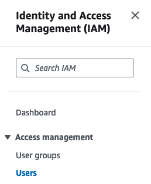
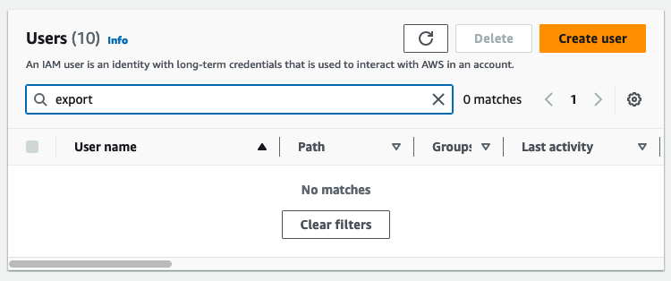
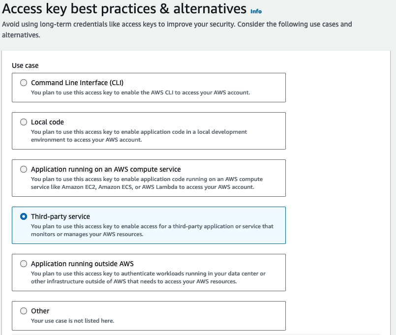
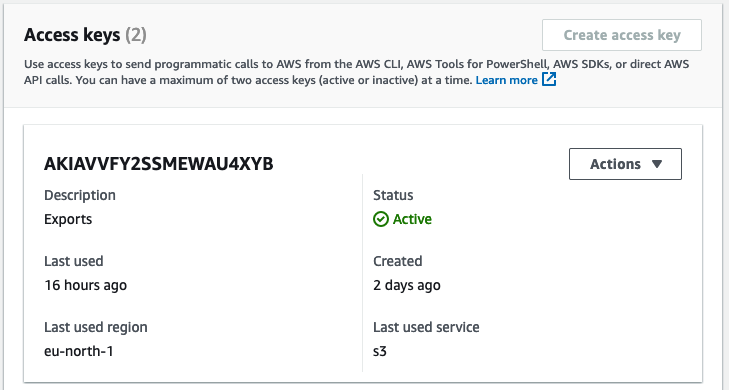
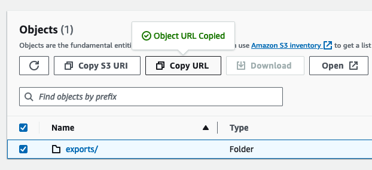
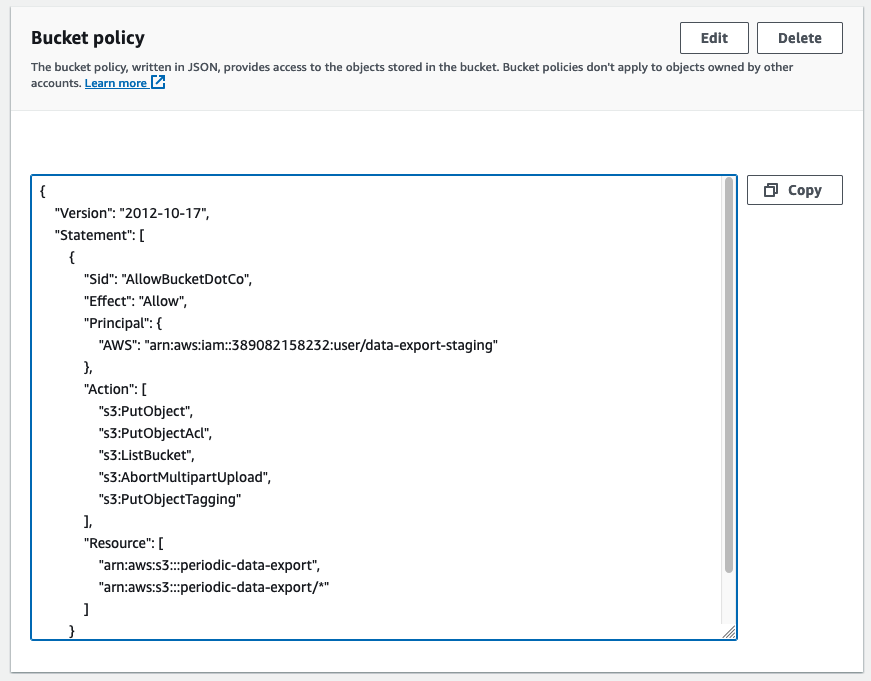

# AWS S3

To configure a [Scheduled data](../product-handbook/data-export.md#scheduled-export) export to an Amazon S3 bucket, follow the steps outlined below:

### Steps

Log into the AWS Console and navigate to _"Identity and Access Management (IAM)"_ and select the _"Users"_ option:\
\
\


For security reasons, we recommend creating a new restricted user to access the designated S3 bucket. Use the **Create user** button to create a new user:\


\


Select the desired user, in the _"Users"_ pane, click on the _"Security credentials tab"_, and scroll down to _"Access Keys"_ section. There, click "Create Access Key" to obtain a new pair of **Access Key** and **Secret Access Key**:\
\
\




\
Once these steps have been completed, copy the user's ARN (AWS unique resource number). This ARN will be required when setting up the permissions on the S3 bucket.

Navigate to [https://s3.console.aws.amazon.com/s3/buckets/](https://s3.console.aws.amazon.com/s3/buckets/) to open the S3 configuration section.

Create or select an existing S3 bucket. In the bucket details pane, create a new folder (optional), and use the **Copy URL** functionality to get the public URL. This URL will be required when configuring the Scheduled Data Export in Bucket:



Switch to the _"Permissions"_ tab of the S3 bucket details pane. Scroll down to the _"Bucket policy"_ section. Normally, if no other policies have been set up, it will be empty. Click on _"Edit"_ and paste the provided policy into the editor. If there are other policies configured, they will need to be combined:\
\


Paste this policy into the policy editor. If there are already other statements in the S3 bucket's policy, copy the statement object and paste it into the list. Replace `<user_arn>` and `<bucket_arn>` with the real values from the AWS account:

```json
{
    "Version": "2012-10-17",
    "Statement": [
        {
            "Sid": "AllowBucketDotCo",
            "Effect": "Allow",
            "Principal": {
                "AWS": "<user_arn>"
            },
            "Action": [
                "s3:PutObject",
                "s3:PutObjectAcl",
                "s3:ListBucket",
                "s3:AbortMultipartUpload",
                "s3:PutObjectTagging"
            ],
            "Resource": [
                "<bucket_arn>",
                "<bucket_arn>/*"
            ]
        }
    ]
}
```

Following the steps above, one should have the **URL**, **Access Key**, and **Secret Access Key** settings required to configure [Scheduled data export](doc:data-export#scheduled-export) in Bucket.
