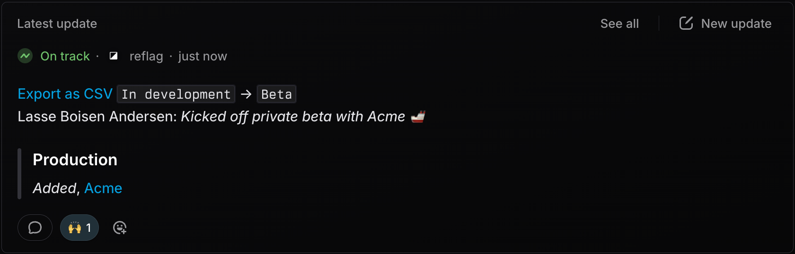

# Linear

## Connect to Linear

For most integrations, you first need connect Reflag with your Linear account. To do so:

1. Navigate to **Settings** > **Organization**
2. Click "**Connect to Linear**"
3. For the [Agent](linear.md#agent) integration, **select the app** you want to manage in the dropdown.

## Integrations

<table><thead><tr><th width="218.89453125">Name</th><th>Use case</th></tr></thead><tbody><tr><td><strong>Agent @-mention</strong></td><td>Create features and manage feature access from Linear</td></tr><tr><td><strong>Broadcast</strong></td><td>Share feature access changes to Linear issues or projects</td></tr><tr><td><strong>Project template</strong></td><td>Add default issue to create feature flag in new Linear projects</td></tr></tbody></table>

***

### Agent @-mention

The Agent integration enables you to `@reflag` within Linear.&#x20;



#### Creating features

Example: `@reflag create feature flag for this issue`&#x20;

#### Managing feature access and stage

Example: `@reflag release to everyone and bump stage to GA`&#x20;

#### Link issue to feature

Example: `@reflag link to <feature name/key>`

***

### Broadcast

The broadcast integration posts feature access change to a Linear issue or project.

<figure><figcaption></figcaption></figure>

Here's how to get started:\

1. Make sure you've [connected](linear.md#first-connect-to-linear) to Linear.
2. In the feature sidebar, select a Linear issue or project.
3. Whenever you change feature access or stage, you can choose to also send the changes to the chosen Linear issue or project.

When you link a feature with a Linear issue or project, you'll see a link to the feature on the Linear issue or in the project resources.

***

### Template

When you start working on a new project in Linear, we recommend adding a "Create feature flag" issue.&#x20;

<figure><figcaption>
A Linear project template with an issue included by default to make it easy to get started with features in Reflag
</figcaption></figure>

This way, when you start a new project, part of the initial work will be setting up a feature in Reflag.&#x20;

By using [Linear project templates](https://linear.app/docs/project-templates#create-templates), you can automate this so that all new projects come with the option to create a Reflag issue.

Pro tip: You can link directly to Reflag's "New feature" modal with the [flag.new](https://flag.new) shortcut.

