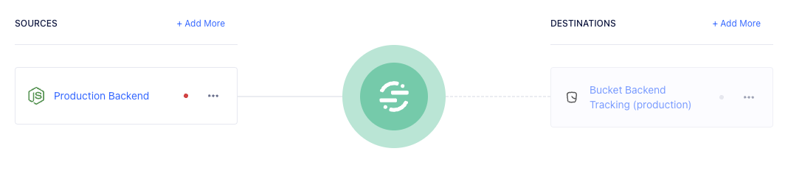

# Segment

Bucket's segment integration is for customers who already use Segment for event tracking and want to use Segment for gathering adoption metrics in Bucket

Info: To use Bucket feature flagging and feedback capabilities, you need to install a [Bucket SDK](../quickstart/supported-languages-frameworks/).

## Set up server tracking

Tracking from backend services can be done through Segment cloud destinations with the [Bucket Cloud Destination](https://segment.com/docs/connections/destinations/catalog/bucket/).

Note: There's also a "Bucket Web (Actions)" integration which is no longer recommended.&#x20;

### Implementation steps

* Set up [Bucket Cloud destination](https://app.segment.com/goto-my-workspace/destinations/catalog/bucket) to receive data from a Segment source.

<figure><figcaption></figcaption></figure>

* Copy your Bucket publishable key from the `Environments` page in `Settings` and add it to the `API Key` settings field in the destination.
* Enable the destination.
* Check the `Tracking` page in Bucket to ensure the data arrives. Data should start flowing immediately.


[Automated feedback surveys](../product-handbook/feature-analysis/automated-feedback-surveys.md) won't be automatically enabled when using a cloud destination as browser scripting is required for gathering customer feedback in your app UI.


## Tracking page views

Bucket supports `analytics.track(),` `analytics.identify()` and `analytics.group()` , but doesn't support the Segment `analytics.page()` call to track pages and the will ignore `page()` calls.

