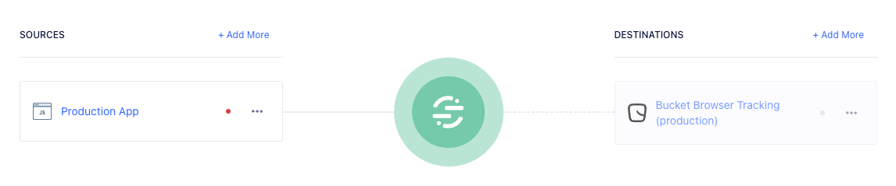
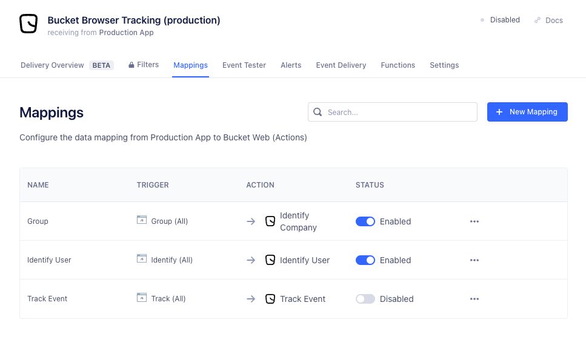

# Segment

In order to get started quickly with the full set of tracking and customer satisfaction collection in your app, we recommend always to use browser tracking. This can be done by enabling the [Bucket Web (Actions) destination](https://app.segment.com/goto-my-workspace/destinations/catalog/bucket-web)

### Set up browser tracking (recommended)

Tracking in the browser through Segment Analytics.js can be done by using the [Bucket Web (Actions) destination](https://app.segment.com/goto-my-workspace/destinations/catalog/bucket-web). It loads the Bucket Tracking SDK for you and automatically enables [Live Satisfaction](../product-handbook/automated-feedback-surveys.md) for immediate customer feedback.

* Set up [Bucket Web (Actions) destination](https://app.segment.com/goto-my-workspace/destinations/catalog/bucket-web) to receive data from a Segment website source.

<figure><figcaption></figcaption></figure>

* Copy your Bucket publishable key from the "Tracking" page and add it to the "Publishable Key" settings field in the destination

| Bucket tracking page                                                          |   | Segment destination settings                   |
| ----------------------------------------------------------------------------- | - | ---------------------------------------------- |
|  | → |  |

* If you are using strict Content Security Policies, follow the instructions about [Content Security Policy](segment.md#content-security-policies-csp) setup
* Enable the destination
* Check your Bucket Tracking page for data to arrive. This can take a while because Segment caches your Analytics.js configuration. Check back in a while

> If you are using both browser and server destinations from the same Segment source, you should also read[ Running both server and browser tracking](segment.md#running-both-server-and-browser-tracking)

### Set up server tracking

Tracking from your backend services can be done through Segment cloud destinations. For Bucket tracking, use [Bucket Cloud Destination](https://segment.com/docs/connections/destinations/catalog/bucket/)

* Set up [Bucket Cloud destination](https://app.segment.com/goto-my-workspace/destinations/catalog/bucket) to receive data from a Segment source

\


<figure><figcaption></figcaption></figure>

* Copy your Bucket publishable key from the "Tracking" page and add it to the "API Key" settings field in the destination\


| Bucket tracking page                                                          |   | Segment destination settings                                                              |
| ----------------------------------------------------------------------------- | - | ----------------------------------------------------------------------------------------- |
|  | → |  |


* Enable the destination
* Check your Bucket Tracking page for data to arrive. Data should start flowing immediately

> [Live Satisfaction](../product-handbook/automated-feedback-surveys.md) will not be enabled when using a cloud destination, as browser scripting is required for gathering customer feedback in your app UI

### Running both server and browser tracking

If you are running both server tracking and browser tracking to the same Bucket app from the same Segment source, you will get duplicate events tracked. To avoid this, disable the mapping of `Track Event` in the `Bucket Web (Actions)` destination so your mapping looks like this:

<figure><figcaption></figcaption></figure>

### Tracking page views

Bucket doesn't support the Segment `analytics.page()`-call to track pages. If page views are important for you, you can convert `page` events to `track` events in the [Bucket Web (Actions) destination](https://app.segment.com/goto-my-workspace/destinations/catalog/bucket-web) like this:

* Go to the "Mappings" tab
* Press "New Mapping"
* Select the "Track Event" action
* In the "Select events to map and send" section, change the event type from `event` to `page`
* In the "Select mappings" section, change the `Event Name` mapping to send in the Segment events `name` field. Optionally prefix it with `Page:` or append with `Viewed` to be able to add a distinguishable pattern from your normal event names



### Content Security Policies (CSP)

If you are running with strict Content Security Policies active on your website, you will need to enable these directives in order to use this destination.

These Content Security Policy rules are only needed when using the browser-based destination Bucket Web (Actions), not when using the server-based destination Bucket Cloud.

| Directive       | Values                                                             | Module            | Reason                                                                                                                                   |
| --------------- | ------------------------------------------------------------------ | ----------------- | ---------------------------------------------------------------------------------------------------------------------------------------- |
| script-src-elem | [https://cdn.jsdelivr.net](https://cdn.jsdelivr.net)               | bootstrap         | Loads the Bucket tracking SDK from a CDN                                                                                                 |
| connect-src     | [https://tracking.bucket.co](https://tracking.bucket.co)           | tracking          | Used for all tracking methods: `analytics.identify()`, `analytics.group()` and `analytics.track()`                                       |
| connect-src     | [https://livemessaging.bucket.co](https://livemessaging.bucket.co) | live satisfaction | Server sent events from the Bucket Live Feedback service, which allows for automatically collecting feedback when a user used a feature. |
| style-src       | 'unsafe-inline'                                                    | feedback UI       | The feedback UI is styled with inline styles. Not having this directive results unstyled HTML elements.                                  |

As HTTP-header:

```http
Content-Security-Policy: script-src-elem https://cdn.jsdelivr.net; connect-src https://livemessaging.bucket.co https://tracking.bucket.co; style-src 'unsafe-inline'
```

As `<meta>`-tag:

```html
<meta http-equiv="Content-Security-Policy" content="script-src-elem https://cdn.jsdelivr.net; connect-src https://livemessaging.bucket.co https://tracking.bucket.co; style-src 'unsafe-inline'">
```

