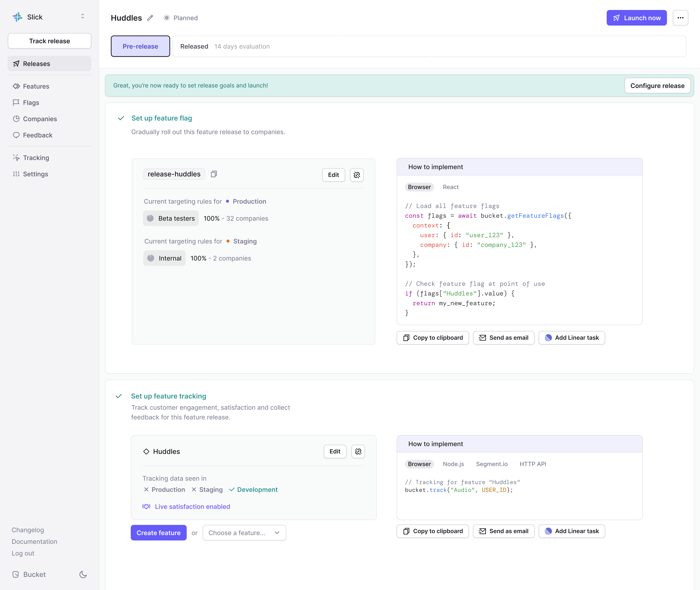

# Create your first Release

### What's a Release?

Releases is an integrated feature management workflow that enables your team to roll out feature releases and easily evaluate their success with metrics and customer feedback.

Releases combines [feature flags,](../introduction/concepts/feature-flag.md) [features](../introduction/concepts/feature/), [STARS](../introduction/concepts/feature/stars.md), [Live Satisfaction](../introduction/concepts/feature/live-satisfaction.md), and a [Slack integration](../integrations/slack.md) in a workflow.

### Getting started&#x20;

* Navigate to Releases and click the `New release` button
* Give the Release a name

### Set up a feature flag

If you have [created a feature flag](create-your-first-feature-flag.md), select it from the `Choose a flag` dropdown.

You can also create a new flag. Add a flag key and a description (optional). To adjust targeting rules and settings, click the `Edit` button after adding the new feature flag.&#x20;

The `Unlink` button removes the associated feature flag in case you picked the wrong one.&#x20;

### Set up feature tracking

If you’ve [created the feature](create-your-first-feature.md), select it from the `Choose a feature` dropdown.

You can add new features as well. Give the feature a name, select a [feature view](https://docs.bucket.co/product-handbook/create-your-first-feature#select-a-feature-view), choose [the source](https://docs.bucket.co/product-handbook/create-your-first-feature#choose-the-source), and set a [target segment](https://docs.bucket.co/product-handbook/create-your-first-feature#select-a-target-segment).&#x20;

[Live Satisfaction](automated-feedback-changes.md) is enabled by default.

After selecting or creating a feature, you will see the feature’s Tracking Status in different environments and whether Live Satisfaction is enabled or disabled. A `✓` indicates that feature events have been tracked in that environment. An `X` means that no feature events have been tracked in that environment.&#x20;

To enable or disable Live Satisfaction and/or change a feature view, source, or target segment, click the `Edit` button after selecting or creating a feature.&#x20;

The `Unlink` button removes the associated feature in case you picked the wrong feature.

#### Setting up multiple features

You can track as many features as you’d like within a Release. Follow the same steps as above to add existing features or create new ones.

This is useful when you roll out and evaluate a feature with multiple sub-features.&#x20;

**Example**

You are rolling out the Huddles feature to your beta testers. Within Huddles, there are the Audio Huddle, Video Huddle, Group Huddle, and In-Huddle Chat features.&#x20;

You can add these sub-features to a Release to evaluate them together and place them behind a single feature flag.   &#x20;

### Implement the flag and feature

Set up a Bucket SDK for your language and framework and implement the code snippet found on the right. Find the[ supported languages here.](../quickstart/supported-languages.md)

<figure><figcaption></figcaption></figure>

### Create Release goals

* After setting up a feature flag and feature(s), click the `Configure release` button
* Click the `Add your first goal` button

Select the feature you want to set the goal for. This should be one of the features you have added to your Release.

Choose the metric you want to track. You can use any of the following metrics.

#### Metrics available for goals

STARS step

* `Adopted`
* `Retained`
* `Satisfied`

STARS rate

* `Adoption rate`
* `Retention rate`
* `Satisfaction rate`

Other

* `Feedback count`
* `Frequency rate`

#### Measurement types

If you select a STARS step metric, you will need to choose one of the following Measurement types:

* `Percentage`&#x20;
* `Count`

<figure><figcaption></figcaption></figure>

If you choose `Percentage`, the goal value will be based on a percentage of companies in your subsegment.&#x20;

If you choose `Count`, the goal value will be based on a raw number of companies.&#x20;

### Set the evaluation period

In the sidebar, choose your Release date using the `dd:mm:yyyy` date format and set the length of the evaluation period.

The default evaluation period value is 14 days.&#x20;

### Choose Slack channel

You can choose to enable notifications that automatically update you on goal progress.&#x20;

Slack notifications are disabled by default.&#x20;

If you choose to enable notifications, select the Slack channel where you want to receive updates.&#x20;

If no channel is selected, you will not receive notifications.&#x20;

<figure><figcaption></figcaption></figure>

### Launch your Release

* Click the `Launch now` button in the top right corner
* Click the `Launch it` button in the pop-up interface to confirm&#x20;

### Follow goal progress

You’ve launched the feature and are evaluating it. Bucket automatically tracks quantitative metrics with [STARS](../introduction/concepts/feature/stars.md) and collects qualitative feedback with [Live Satisfaction](automated-feedback-changes.md).

If you’ve activated Slack notifications, you will receive weekly goal updates.

<figure><figcaption></figcaption></figure>

### Completing or extending the Release

When the evaluation period has ended, you will receive a final summary of your Release’s performance in Slack (if notifications are enabled).

<figure><figcaption></figcaption></figure>

If you want to extend the evaluation period, click the `Extend evaluation` button in the top right corner.

#### Example

You have released Huddles to your Beta testers segment with a `Tried` goal of 50% for an evaluation period of 14 days.

However, you have released the feature during the holiday season. When the evaluation period ends on day 14, your `Tried` value is only 30%.&#x20;

You can extend the evaluation period to give more time for companies to try the feature.&#x20;
