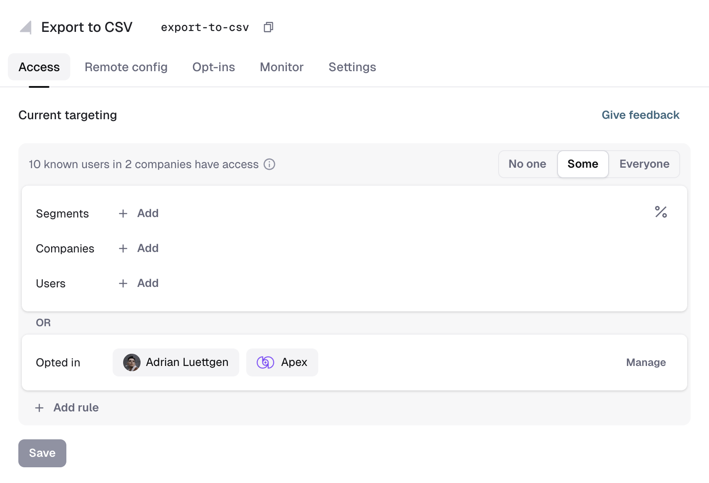
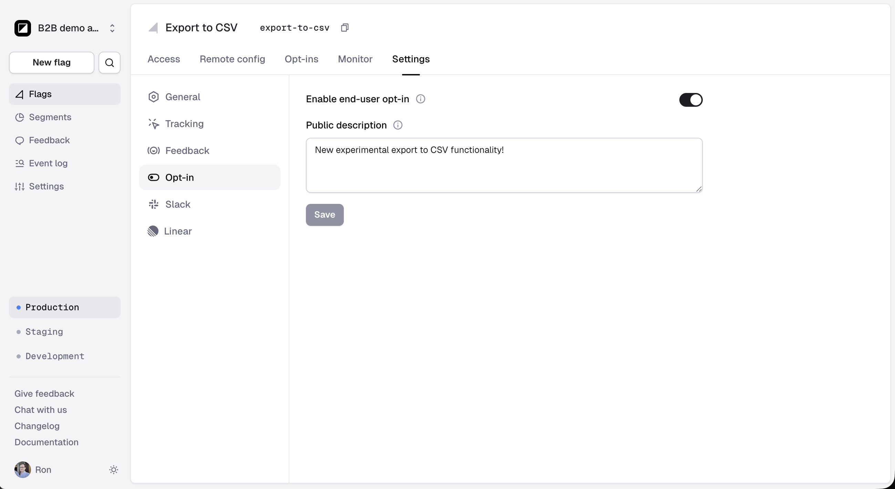
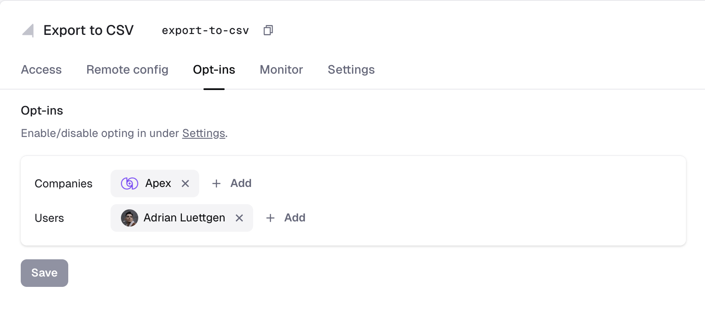

# End-user opt-in

Reflag makes it easy to let end users opt into new, experimental, or beta features.

Unlike regular [access rules](feature-rollouts/feature-targeting-rules.md), which are controlled entirely by your team, end-user opt-in lets users choose whether they want access. You build the opt-in experience in your product, while Reflag manages opt-in membership and evaluates access.

## When to use it

End-user opt-in is useful when you want experienced or adventurous users to try features that are not yet ready for everyone.

Common use cases include:

* Experimental or beta features
* Early access programs
* Redesigned parts of your product
* A redesigned version of your entire application
* Optional workflows intended for advanced users

For redesigns, opt-in lets users move between the old and new experiences themselves while you collect feedback and continue improving the new version.

## How opt-in affects access

Opt-in works alongside your existing access rules. A user receives access when they match either:

* One of the flag's regular access rules
* An active user or company opt-in

The flag's access setting determines how opt-ins behave:

| Access setting | Behavior |
| --- | --- |
| **No one** | The flag is off. Existing opt-ins are inactive, and new opt-ins are rejected. |
| **Some** | Access is granted through regular access rules or opt-in membership. |
| **Everyone** | Everyone has access, regardless of opt-in membership. |

For a feature available exclusively through opt-in, select **Some** and leave the other access rules empty.

<figure><figcaption>
Opt-in membership appears separately from regular access rules and is combined with them using OR.
</figcaption></figure>

## Configure end-user opt-in

To enable opt-in for a flag:

1. Open a non-secret flag in Reflag.
2. Select **Settings**.
3. Open the **Opt-in** section.
4. Enable **End-user opt-in**.
5. Optionally enter a **Public description**.
6. Save your changes.

The public description is exposed through Reflag's client-side SDKs. You can display it in your product's opt-in interface to explain the feature to your users.

<figure><figcaption>
Enable end-user opt-in and optionally add a public description.
</figcaption></figure>


End-user opt-in cannot be enabled for secret flags. Opt-ins are submitted directly from a browser or client using a publishable key, so the flag must be publicly available.


Opt-in is enabled at the flag level, but access is configured separately for each environment. In every environment where users should be able to opt in, ensure that **Access** is set to **Some**, rather than **No one**.

When you enable opt-in while the current environment is set to **No one**, Reflag changes its access setting to **Some**.

## User and company opt-ins

Your opt-in interface can let end users opt in at either of two scopes:

* **User opt-in** gives access to one user.
* **Company opt-in** gives access to users evaluated as members of that company.

The scope depends on how you build your opt-in interface. For example, a personal beta-preferences page might use user opt-ins, while an organization settings page might let an administrator opt in the entire company.

User and company opt-ins are independent. A user can be opted in personally, through their company, or through both scopes. Removing one membership does not remove the other.

## View opted-in users and companies

After enabling end-user opt-in, an **Opt-ins** tab appears next to the flag's **Access** tab.

As end users opt in, their memberships appear in two places:

* The **Access** tab shows opted-in users and companies as a separate, read-only access path alongside your regular access rules.
* The **Opt-ins** tab provides an editable list for the selected environment.

The **Access** tab helps you understand the flag's effective audience. Opt-in membership is combined with your other access rules using **OR**, so an opted-in user or company can receive access without matching another rule.

## Manage opt-ins

Use the **Opt-ins** tab to add or remove opted-in users and companies manually.

You can select known users or companies individually. To add a larger audience, open the user or company selector, choose **Import**, and paste IDs separated by commas, spaces, or line breaks.

<figure><figcaption>
View and manage company and user opt-ins for the selected environment.
</figcaption></figure>

Membership changes apply only to the currently selected environment.

## Disable end-user opt-in

Disabling end-user opt-in:

* Prevents new opt-ins from being added.
* Makes existing memberships inactive, so they no longer grant access.
* Retains existing memberships instead of deleting them.
* Still allows existing memberships to be removed from the **Opt-ins** tab.

If you enable opt-in again, retained memberships become active again as long as the environment's access setting is not **No one**.

## Build an opt-in interface

Reflag does not impose a particular end-user experience. You can build a Labs page, beta settings page, organization-level experiments page, or any other interface that fits your product.

See [Beta feature opt-in](../guides/self-opt-in.md) for a step-by-step React implementation using Reflag's SDK hooks.
