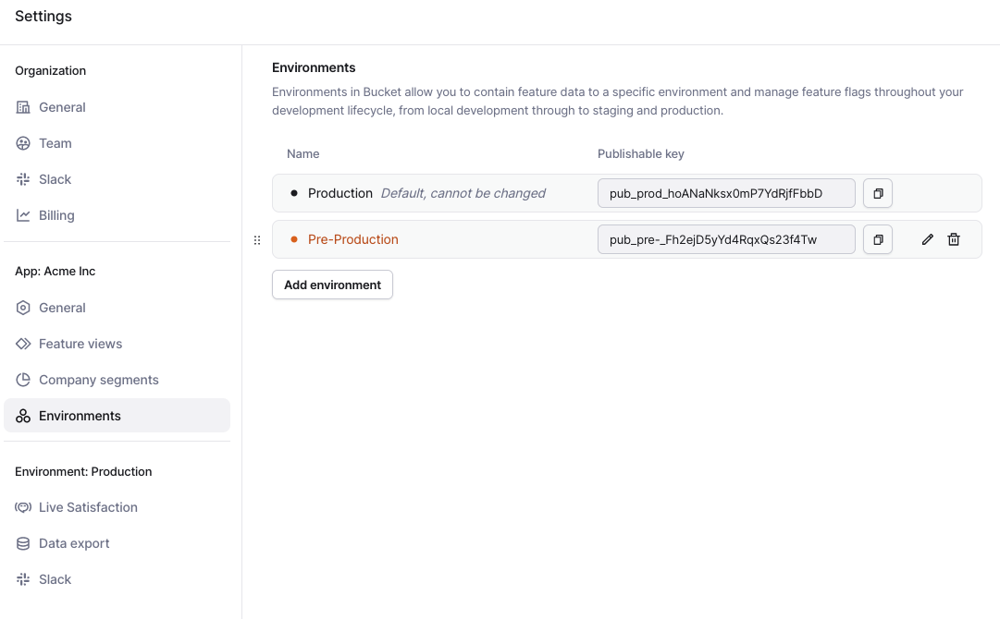
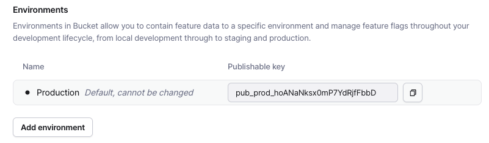
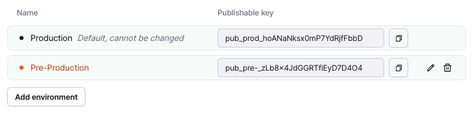

# Environments

### What are Environments

The environments feature allows you to create and manage distinct environments within our platform, like **development**, **staging**, and **production**. Each environment can be configured independently, providing a structured approach to handling feature data throughout your application's lifecycle.

Each application defined within our platform comes pre-configured with two default environments: **Production,** **Staging,** and **Development**.

Other environments can be freely added at any point and all except **Production** can be edited and deleted anytime.

<figure><figcaption></figcaption></figure>

### Benefits

Each environment you create is assigned a unique **publishable key**. This key is essential for integrating your applications with our platform. It ensures that events and data are attributed to the correct environment.

Using these keys, you can seamlessly send data from your applications to the appropriate environment, maintaining clear separation and organization of data.

Learn how to use the publishable key in our [Getting Started](ref:getting-started) guide.

Some of the major benefits of using separate environments within your development workflow include:

* **Data Segregation**: Keep your development, staging, and production data separate, ensuring clarity and preventing cross-environment interference.
* **Controlled Testing**: Safely test new features and updates in isolated environments before deploying them to production.
* **Improved Workflow**: Streamline your development process by clearly delineating stages and ensuring that each phase is properly managed.

To provide you with all these benefits, Environments neatly integrate with Feature Flags and Releases.

### Managing environments

#### Create a New Environment

To create a new environment, head to the _Settings_ page and select the _Environments_ menu item listed under your application.

<figure><figcaption></figcaption></figure>

Click the _"Add environment"_ button and provide a name for your new environment. After clicking _"Create"_, the new environment will appear in the list, alongside its associated **publishable key**.

<figure><figcaption>
Environments after adding "Pre-Production"
</figcaption></figure>

Note that the _"Production"_ environment cannot be deleted or edited, while the new one can be amended or deleted at any time.

#### Switching Between Environments

To switch between environments, click the top-left app switcher in the Bucket app.

Click on any other environment listed below the application's name to switch to that environment.

When a non-Production environment is active, it will be displayed under the current application's name in the app switcher.

### Environment settings

When navigating to settings in the sidebar, you'll see three levels of settings:

* _"Organization"_, contains the organization-wide settings,
* _"App: name"_, contains the application-wide settings, and,
* _"Environment: name"_, contains the settings that are environment-specific for the current application.


Some settings are _"Production environment"_-only and are disabled when a non-_"Production"_ environment is active.


### Application-wide Functionality

The following entities and configuration options are considered application-wide and not dependent on any environment:

* _"Company Segments"_ are shared across all environments. The actual companies that are part of these segments vary across environments though.
* _"Features"_ are application-wide except for their _"Integration"_ and _"Live Satisfaction"_ sections. More explanation will follow below,
* _"Feature Views"_ are application-wide except their _"Slack Reporting"_ settings,
* _"Releases"_ are application-wide as well. It is important to note that the goals within each release are evaluated using data from the _"Production"_ environment,
* _"Feature Flags"_ are defined per application but their activation rules are environment-specific.

When you're configuring application-wide settings, the selected environment plays no role. In some places through the Bucket application,  you may ee a small info banner to remind you of this.

#### Production Environment-based Functionality

In some cases, there are environment-specific options that are only allowed in the _"Production"_ environment and are not used in any other environments. These are

* _"Slack"_ and reporting settings in the "_Feature Views"_, _"Features"_, _"Releases"_ can all be configured from any environment, but apply to the _"Production"_ environment,
* In some cases, configuration sections are disabled if the selected environment is not _"Production"_.

The rationale behind this choice is that some functionality does not make sense outside of _"Production"_ environment, and yet, it is environment-specific due to the data segregation employed by Bucket.

#### Environment-based Functionality

All other settings and functionalities are deemed to be environment-specific. In particular, anything that requires data sent to Bucket from the clients is inherently environment-specific due to segregation:

* _"Live Satisfaction"_ options at the application and feature levels are environment-specific,
* _"Data Export"_ is also environment-specific,
* _"Feedback"_, _"Tracking"_ show the data based on the current selected environment,
* "Feature Flag Rules" are defined at environment level.

This is not an exhaustive list. There are many other places within the Bucket where data is somehow environment-specific.
