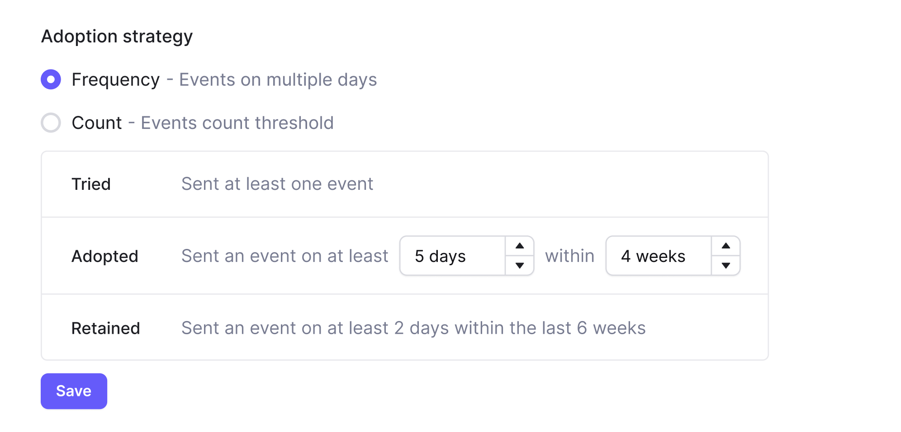
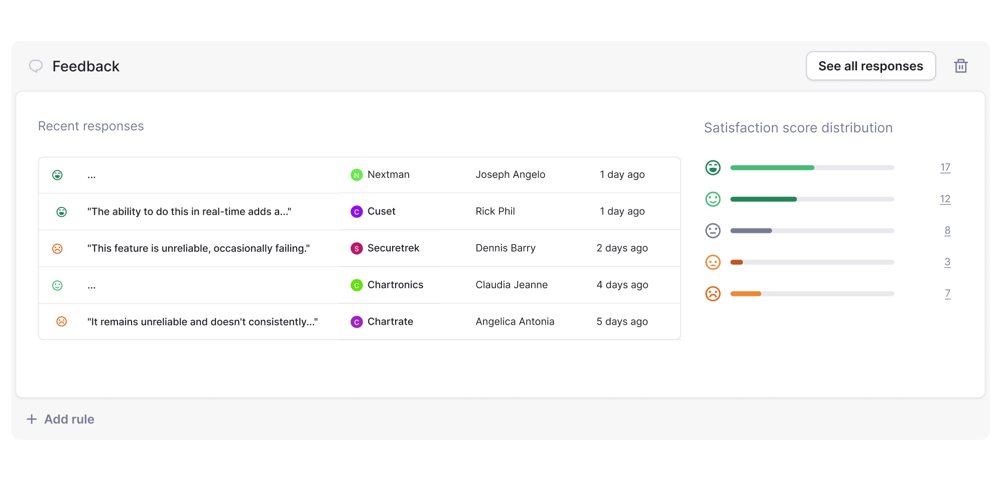

# STARS Framework

## What is the STARS Framework?

STARS ([starsframework.org](https://www.starsframework.org/)) is a funnel that measures feature engagement and satisfaction through quantitative engagement data and qualitative satisfaction scoring.

The framework establishes a common baseline for measuring feature engagement and satisfaction so product teams can consistently make better product decisions.

STARS is automatically applied to all features on Bucket.

STARS stands for:&#x20;

* **S**egment
* **T**ried&#x20;
* **A**dopted &#x20;
* **R**etained&#x20;
* **S**atisfied

<figure><figcaption></figcaption></figure>

## Segment

Segment is used to set the initial size of the funnel. Since certain features are only relevant to certain companies, Segment determines the specific segment of companies that will be given access to a feature.&#x20;

This step is completed before a feature is released.

In Bucket, the Segment value is always 100%.

## Tried

Tried represents the number of companies from the segment that have used the feature at least once.&#x20;

This is shown as a percentage of the total number of companies in the segment.&#x20;

If Tried is low, it indicates that companies are either unaware of the new feature or that it needs to be more intuitive or useful for them to use it.

## Adopted

Adopted shows how many companies are using a feature regularly. In Bucket, you can set the number of times a company needs to use a feature to move into Adopted.

The default Adoption strategy is `Frequency`. `Frequency` refers to how many separate days a company uses a feature over a period.&#x20;

&#x20;The default `Frequency`values are: Sent an event on at least `5 days` within `4 weeks`.

<figure><figcaption></figcaption></figure>

The `Adoption percentage` figure shown in Bucket is the percentage of companies in the segment that have moved to Adopted.

The `Adoption rate` is the percentage of Tried accounts that have moved to Adopted.

Some features will not have both Tried and Adopted statistics. This is because a count of the number of uses doesn’t make sense for every feature.&#x20;

### Example

An integration with other software is activated once through an on/off button. Any further activity will occur elsewhere. In this case, only Adopted will be displayed.

## Retained

Retained shows how many companies from Adopted continue using the feature over time.

Defining the right retention period per feature is critical to measuring Retained correctly. Like the Tried step, it is also defined using `count` or  `frequency`.&#x20;

In SaaS products, most key features should be used at least once per subscription cycle (typically monthly). However, some features aren’t meant to be used that often.&#x20;

So far, every company in the funnel has moved to the next step (you can’t un-try a feature). However, companies can move backward from Retained if they do not continue consistently using a feature. This is called churn. A company that churns from Retained will move back to Adopted.

## Satisfied

In the Satisfied step, we ask the Retained accounts how satisfied they are with the feature.&#x20;

Collecting feature satisfaction is done using a CSAT scoring framework through [automated feedback surveys](automated-feedback-surveys.md). The user provides a score between 1-5 with 1 being very dissatisfied and 5 being very satisfied.

The Satisfied step will remain empty until a user provides feedback. Once a user from a company gives feedback, their rating and comments will be logged and permanently stored even if the company drops off from Retained.&#x20;

However, the Satisfied progress bar displayed at the top of the Bucket interface only counts those currently in Retained.

<figure><figcaption></figcaption></figure>

## STARS states on Bucket

In the Bucket product, you will encounter both STARS _steps_ and _states_.

### STARS steps

STARS steps are those outlined above: Segment, Tried, Adopted, Retained, and Satisfied.&#x20;

You will encounter STARS steps in the Analyze tab of a [Feature](../create-your-first-feature.md).

### STARS states

A STARS state reflects where a company is in the funnel right now.&#x20;

A company can be in multiple STARS steps but will only belong to a _single_ STARS state.&#x20;

The STARS states are:

#### Never

The company has either:

* Never had access to the feature
* Never tried the feature

#### Tried

A company has [Tried](stars-framework.md#tried) a feature.&#x20;

#### Retained

A company has [Adopted](stars-framework.md#adopted) a feature (based on your adoption strategy criteria) and currently meets the retention condition.

#### Churned

A company has Adopted a feature (based on your adoption strategy criteria) but no longer meets the retention condition and has churned from the feature.

<figure><figcaption></figcaption></figure>

You will encounter STARS states when using filters to create [company segments](../feature-targeting-rules/creating-segments.md) in the Companies tab.
