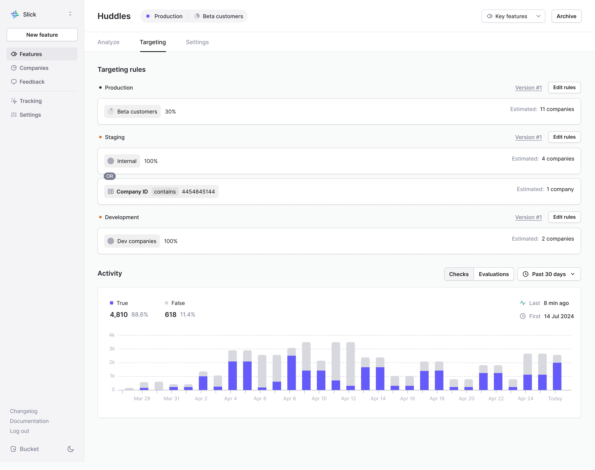

# Feature targeting rules

## What are targeting rules?

Feature targeting lets you conditionally enable features for a company or a user.&#x20;

Using conditions based on company and user attributes, you can target specific groups of users and conditionally enable a feature for them.&#x20;

By using rollout percentages you can roll the feature out to only a certain percentage of companies in the group.

You'll find the feature targeting configuration under the `Targeting` tab in each feature.

## Getting started 

* Create your [feature](../create-your-first-feature.md)
* Select the `Targeting` tab

## Set targeting rules

Each targeting rule has a set of conditions. You can create as many rules with as many conditions as you’d like.&#x20;

### Conditions

There are 5 types of conditions:

* `Company attribute`
  * `Company ID`
  * `Company name`
  * `Any user-defined custom attributes`
* `User attribute`
  * `User ID`
  * `Email`
  * `Any user-defined custom attributes`
* `Segment`&#x20;
  * Target existing segments created in the [Companies](creating-segments.md) tab that don’t use `First seen`, `Last seen`, or `Feature metrics` filters.
  * You can include or exclude companies that are part of a segment.
* `Feature targeting`&#x20;
  * Re-use targeting rules from another feature. You can choose to include or exclude companies that are targeted by another feature.&#x20;
* `Other context`
  * Set targeting rules based on custom data that does not belong to a company or user but rather a specific situation that a company or user is in, like an `eventID`.
  * Example:
    * You can supply `eventID` in the other context. Then, you create a context rule that only enables a feature when your users are in the context of a specific event with the given event ID.

### Operators

When using `company attributes`, `user attributes`, or `other context` you can use any of the following operators:

Any

* `Is`
* `Is not`
* `Has any value`
* `Has no value`

Text

* `Contains`
* `Does not contain`

List

* `Is any of`
* `Is not any of`

Number

* `Less than`
* `Greater than`

Boolean

* `Is true`
* `Is false`

Date

* `Less than X days ago`
* `More than X days ago`

### Examples

Here are examples of targeting conditions:

* Target companies with Company IDs 1 and 2: `Company attribute: Company ID IS ANY OF [1,2]`
* Give access to newly created companies: `Company attribute: createdAt LESS THAN [30] DAYS AGO`
* Give access to users with the manager role at all companies: `User attribute: role IS [manager]`
* Give access to companies in the Beta users’  segment: `Segment: In segment [Beta users’]`
* Give access to companies who already have access to the Huddle feature: `Feature targeting: Feature [Huddle] is enabled`
* Enable feature for a single company but only when managing a particular event: `Company attribute: Company ID IS [42] AND Other context: eventID IS [641]`

<figure><figcaption>
There are 5 different types of conditions to chose from
</figcaption></figure>

## Setting multiple targeting rules 

You can create as many targeting rules as you like. Rules are made up of individual conditions.

Companies will get access to your feature if they meet the criteria of any of the targeting rules. For a rule to match, they must meet all the conditions of that rule. In other words, there’s an `OR` between the rules and an `AND` between the conditions.

### Example

We’ve added two rules. The first rule has two conditions while the second rule has a single condition.&#x20;

If _**any**_ rules match, the feature will be enabled for a given company or user. A rule matches if _**all**_ conditions within it match.&#x20;

Another way to say this is that there’s an `OR` between the rules and an `AND` between the conditions.&#x20;

The rules you create will be different between [environments](./#environments).

<figure><figcaption>
An example targeting configuration with two rules. In the first rule there are two conditions and one condition in the second rule. If any of the rules match and if all the conditions in a given rules match, the company/user will be targeted.
</figcaption></figure>

## Specify rollout percentage

Select a rollout percentage (default value: 100%) to give access to a percentage of companies that match the targeting rules.

Specifying 0% will not enable the feature flag for anyone.

### **Rollout percentages**

Rollout percentages are stable. If the initial rollout percentage is 1% and you roll it out to 100% before rolling it back to 1%, the companies found in the 1% rollout will be the same.

However, companies within the rollout percentages aren’t consistent across features. The companies found in a 1% rollout percentage may be different for different features. To roll out two features to the same set of companies, use the `Feature targeting` condition.&#x20;

**Example**

You have rolled out `Feature A` and `Feature B` to 10% of the `Beta User` segment.

The set of companies within the `Beta User` segment with access to `Feature A` and `Feature B` will not be the same.

## Environments

Apply different targeting rules to distinct [environments](https://docs.bucket.co/product-handbook/environments). You can switch between environments by clicking the `Edit in [Environment]` button.

The default environment is Production.

### **Example**

You give access to 100% of companies in the `Dev companies` segment in the Development environment when creating the feature.

In the Staging environment, roll out the feature to 100% of companies in the `Internal` segment, giving access to everyone in your organization so you can conduct QA testing, as well as to a specific partner who prefers to test new features before they are rolled out with a `Company ID` context rule.

After the initial QA testing in the Staging environment, you roll out the feature flag to 30% of companies within the `Beta customers` segment in the Production environment.

<figure><figcaption></figcaption></figure>

## Rolling back feature targeting changes

See previous targeting rules and roll back to past rules by following the `Version history` link.&#x20;

Find past versions and click the `Rollback button` to reimplement previous targeting rules.

Targeting rules that use segment rules are linked to the current version of the segment even if you roll back to a previous version of the targeting rules.

### **Example**

The `Beta customers` segment contains 40 companies. Version #1 of the Huddles feature targeted 25% of companies in the `Beta customers` segment (10 companies) on January 1st.

On January 15th, you add 20 more companies to the `Beta customers` segment (60 companies).

On January 20th, Version #2 of the Huddles feature targets 50% of companies in the `Beta customers` segment (30 companies).

The next day, you roll it back to Version #1. Since the `Beta customers` segment now contains 60 companies, the feature will be available to 15 companies rather than 10 companies.

