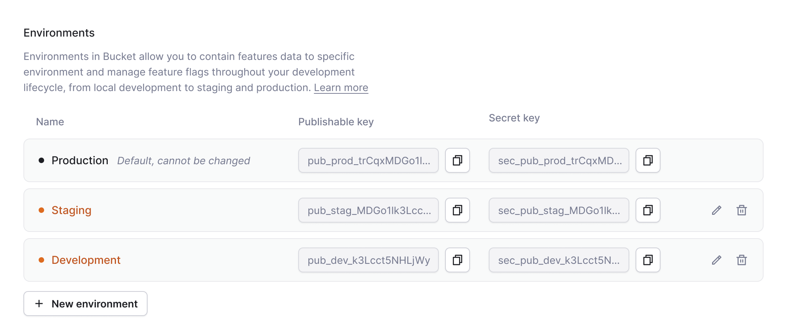

# Environments

What are environments?

An environment is an instance of an app that is specified by a group of shared parameters or servers. Environments are usually used to isolate a production app from testing, however, they can also differentiate multiple single-tenant deployments of the same app.

Bucket has three default environments: `Production`, `Staging`, and `Development`.&#x20;

You can add, edit, and delete as many additional environments as you’d like.&#x20;

All environments except `Production` can be edited or deleted at any time.

## Getting started

* When you create your account, there are three default environments: `Production`, `Staging`, and `Development`.&#x20;
* Go to `Settings`
* Under `App: [Your App Name]`, click `Environments`
* Fetch your unique `publishable keys`  and/or `secret keys` to implement with an [SDK or HTTP API](../../supported-languages/overview.md).
  * This key is essential for integrating your applications with our platform. It ensures that events and data are attributed to the correct environment.

<figure><figcaption></figcaption></figure>

## Managing environments

### Create a new environment

To create a new environment:

* Head to the `Settings` page
* Select the `Environments` menu item listed `App: [Your App Name]`
* Click the `+ New environment` button and give a name for your new environment.
  * If needed, you can rename the environment later
* After clicking the `Create` button, the new environment will appear in the list alongside its associated `publishable key` and `secret key.`

<figure><figcaption>
Environments after adding "Pre-Production"
</figcaption></figure>


The `Production` environment cannot be deleted or edited. New environments can be edited or deleted at any time.


### Switching Between Environments

You can switch between environments by:

* Click the app switcher interface in the top-left corner of the browser
* Click on an environment listed below the application's name to switch to that environment
* When a non-Production environment is active, it will be displayed under the current application's name in the app switcher.

<figure><figcaption></figcaption></figure>

## Environment settings

There are three levels of settings in Bucket:

* `Organization`: _C_ontains the organization-wide settings
* `App: [Your App Name]`: Contains the application-wide settings
* `Environment: [Name]`: Contain environment-specific settings for the current application.

### Application-wide functionalities

When you're configuring application-wide settings, environments aren't applicable.

The following entities and configuration options are application-wide and not dependent on an environment:

* `Feature Views`: They're application-wide except for their `Slack Reporting` settings,
* `Company Segments`: They are shared across all environments. However, the companies in these segments will vary across environments.

### Production environment-based functionalities

There are environment-specific functionalities that are only allowed in the `Production` environment. These are:

* `Slack`: Reporting settings in [Features](../create-your-first-feature.md) and [Feature views](https://bucket.co/glossary/feature-views) can be configured from any environment, but are also reflected in the `Production` environment
* Some configuration sections are disabled if the selected environment is not `Production`.


Some settings are `Production environment`-only and are disabled when a non-`Production` environment is active.


### Environment-based functionalities

All other settings and functionalities are environment-specific. Anything that requires data to be sent from the clients is inherently environment-specific. This includes:

* [Targeting rules](./)
* [Automate feedback surveys](../feature-analysis/automated-feedback-surveys.md)
* [Feedback](../product-overview.md#feedback)
* [Tracking](../product-overview.md#tracking)
* [Data export](../data-export.md)
