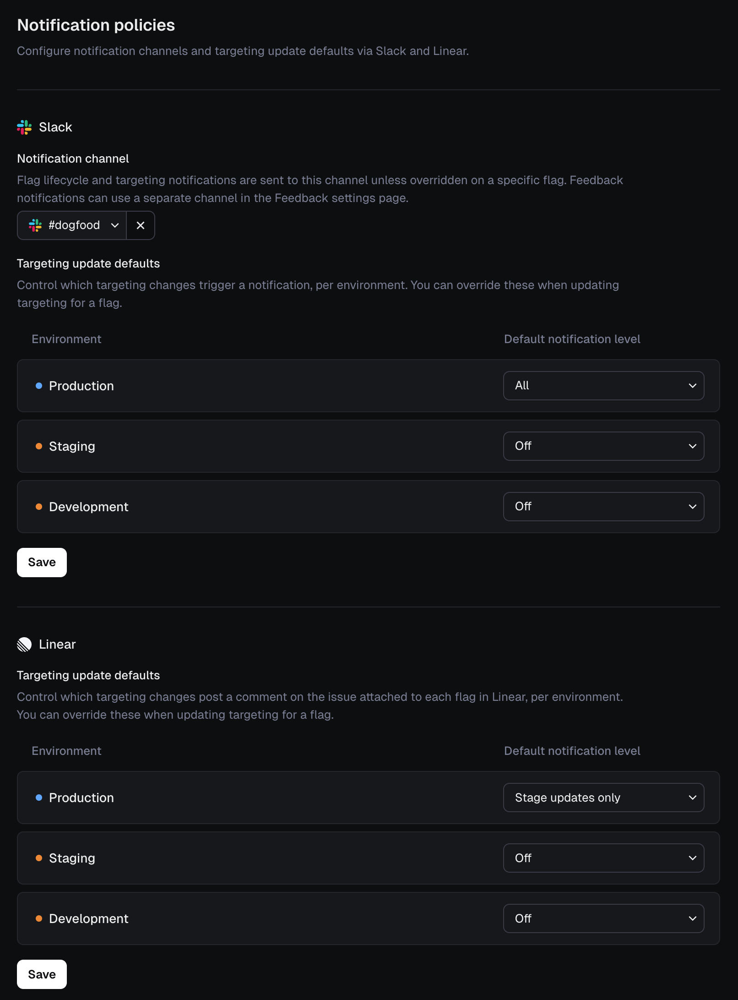

# Notification Policies

Notification policies **control the default Slack and Linear notifications** sent when flag targeting changes. Policies are set per environment.

When updating targeting, these defaults are preselected. You can override them before saving the change.

Notification policies allow you to configure:

* An app-level Slack channel for lifecycle and targeting notifications
* A notification level for each environment
* Separate defaults for Slack and Linear

You configure notifications policies under **Settings / Notification Policies**

<figure><figcaption></figcaption></figure>

## Notification levels

Each integration can use one of the following levels:

| Level                  | Behavior                                           |
| ---------------------- | -------------------------------------------------- |
| **All**                | Send a notification for every targeting update     |
| **Stage updates only** | Send a notification only when a flag changes stage |
| **Off**                | Do not send a notification by default              |

## Environment defaults

Production environments are more verbose by default.

| Environment    | Slack | Linear             |
| -------------- | ----- | ------------------ |
| Production     | All   | Stage updates only |
| Non-production | Off   | Off                |

## Integration behaviour

#### Slack

Notifications use the app-level channel unless a flag has its own Slack channel configured.

#### Linear

Notifications are posted to the issue or project attached to the flag.

#### Feedback notifications

Feedback notifications can use a separate Slack channel configured on the **Feedback settings** page.
