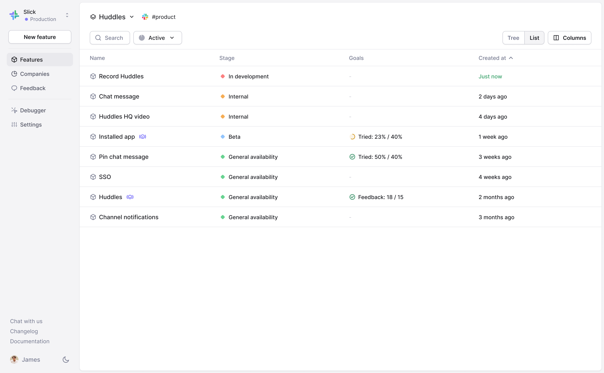
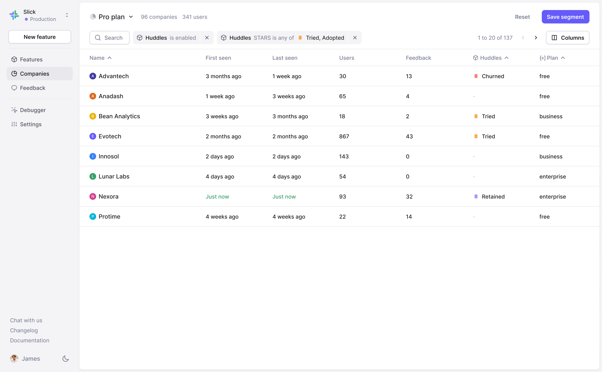
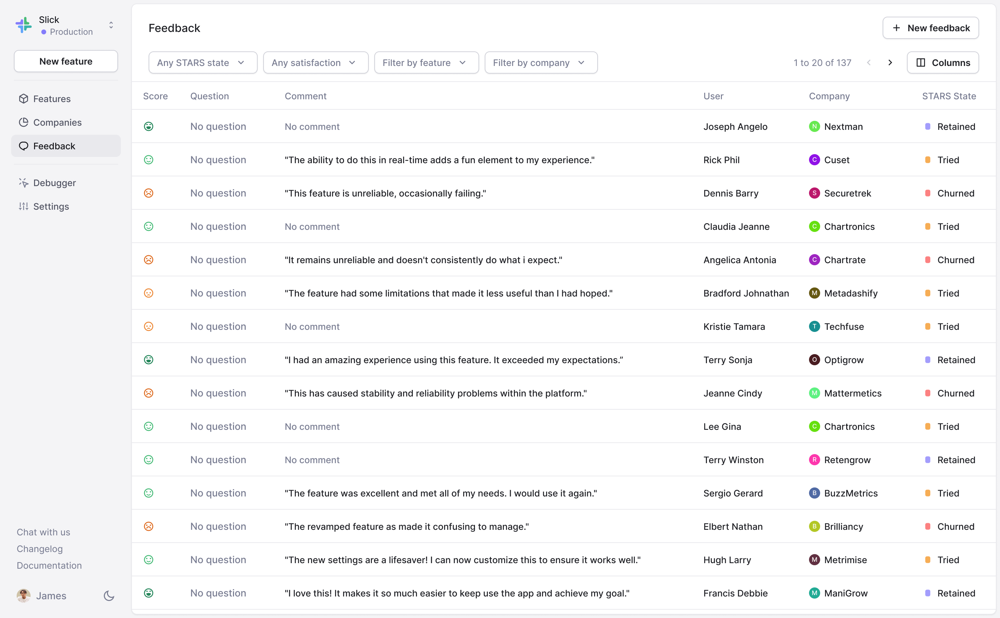
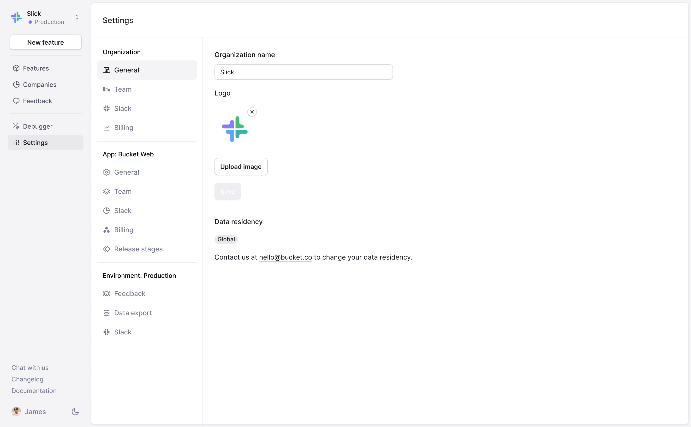

# Product overview

## Features

The Features tab of Bucket is where you create and manage your features.

<figure><figcaption></figcaption></figure>

## Feature page

[Feature](create-your-first-feature.md) pages are where you create and manage feature flags, set targeting rules, track engagement metrics, and automatically collect feedback for individual features.&#x20;

<figure><figcaption></figcaption></figure>

## Companies

The Companies tab lists all of the companies that use your application. \
\
A company is a group entity for end users. Bucket auto-aggregates at the company level (also known as a group level in group analytics terminology) rather than the user level.

This is where you can create [segments](feature-targeting-rules/creating-segments.md) and [feature views](feature-views.md).

<figure><figcaption></figcaption></figure>

## Feedback

The Feedback tab shows you CSAT scores and qualitative feedback from [automated feedback surveys](feature-analysis/automated-feedback-surveys.md).  You can filter by [STARS](feature-analysis/stars-framework.md) step, satisfaction score, [feature](create-your-first-feature.md), or [company](feature-targeting-rules/creating-segments.md).

<figure><figcaption></figcaption></figure>

## Debugger

The Debugger tab shows you a log of recent events as well as a list of all the distinct events being tracked in Bucket.

<figure><figcaption></figcaption></figure>

## Settings

The Settings tab is where you manage users, billing, [feature views](feature-views.md), [company segments](feature-targeting-rules/creating-segments.md), [environments](feature-targeting-rules/environments.md), [data exports](data-export.md), and more.

<figure><figcaption></figcaption></figure>
