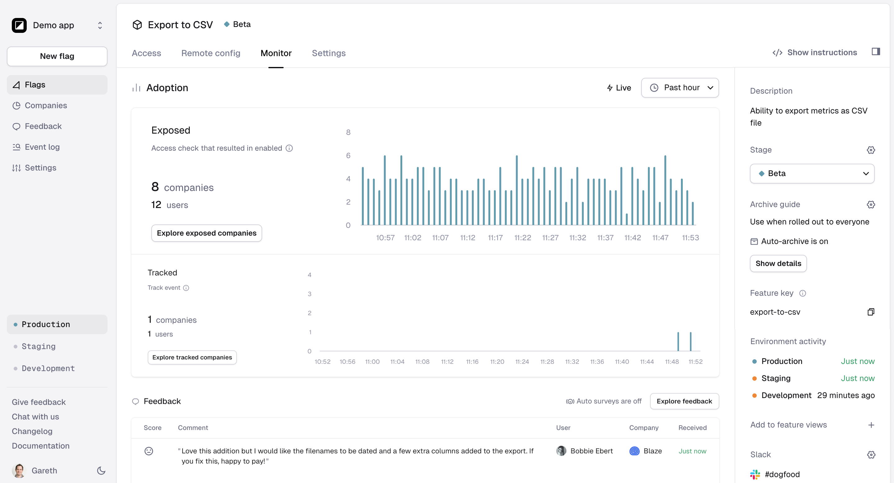

# Product overview

## Flags

The Flags tab of Reflag is where you create and manage your flags.

<figure><figcaption></figcaption></figure>

## Flag page

This is where you create and manage feature flags, set access rules, remote config, and monitor your feature launch.&#x20;

<figure><figcaption></figcaption></figure>

<figure><figcaption></figcaption></figure>

<figure><figcaption></figcaption></figure>

## Companies

The Companies tab lists all of the companies that use your application. You can used advanced filters to filter the companies list and create saved segments.

<figure><figcaption></figcaption></figure>

## Event log

The Event log tab shows you a log of recent events as well as a list of all the distinct events being tracked in Reflag.

<figure><figcaption></figcaption></figure>

## Settings

The Settings tab is where you manage billing, [users](team-permissions.md), [integrations](/broken/pages/kR5OsasKOyLj0Ho6thZa), [feature views](feature-views.md), [company segments](creating-segments.md), [environments](creating-and-managing-apps/environments.md), data exports, and more.

<figure><figcaption></figcaption></figure>
