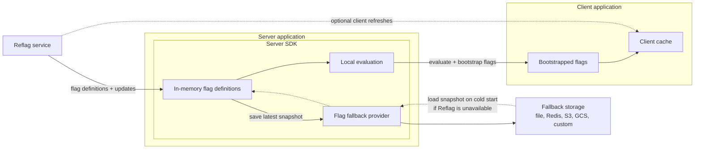

# Service Resiliency

Reflag SDKs are designed to keep flag evaluation working when the Reflag service is temporarily unavailable. The resilience model has four layers, each covering a different failure mode:

1. **Local evaluation** lets already running server processes evaluate flags without calling Reflag at request time.
2. **Flag fallback providers** let newly started server processes load the latest saved flag definitions if they cannot reach Reflag during startup.
3. **Bootstrapped flags** let clients render from server-evaluated flag state included in your server response, instead of waiting for an initial client-side request to Reflag.
4. **Client SDK caching** keeps recent flag state available during short browser or app network interruptions.


For the most resilient production setup, evaluate flags on the server with the Node.js SDK, configure `flagsFallbackProvider`, and bootstrap your client SDK from server-evaluated flag state.


## What happens during a disruption?

| Scenario | Resilience feature | Behavior |
| --- | --- | --- |
| Reflag is unavailable after a server SDK has initialized | Local evaluation and in-memory flag definitions | The running process keeps evaluating flags from the last successfully fetched definitions. |
| A server process starts while Reflag is unavailable | `flagsFallbackProvider` | With a saved snapshot, the process initializes from fallback storage. Without a snapshot, it may not have definitions to evaluate. |
| A client app loads while Reflag is unavailable | Bootstrapped flags | With bootstrapping, the client uses the evaluated flags included in your server response instead of making its own initial request to Reflag. |
| A returning client loads during a network issue | Client SDK caching | The client can reuse recent cached flags if they are still within your cache settings. |
| Reflag becomes available again | SDK refreshes and fallback snapshot updates | SDKs resume refreshing from Reflag, and fallback providers save the latest definitions. |

## Recommended production setup

1. Evaluate flags on the server with a local-evaluation SDK, such as the [Node.js SDK](../sdk/@reflag/node-sdk/) or [OpenFeature Node.js provider](../supported-languages/openfeature.md).
2. Configure a [`flagsFallbackProvider`](../sdk/@reflag/node-sdk/#fallback-provider) so fresh server processes can initialize from saved flag definitions when Reflag cannot be reached.
3. Use [`getFlagsForBootstrap()`](../sdk/@reflag/node-sdk/#bootstrapping-client-side-applications) on the server and a bootstrapped client provider in React, React Native, Vue, or the Browser SDK.
4. If your client SDK supports caching, tune it based on how long your app can tolerate stale flags.
5. Test the disruption path in staging: block access to Reflag, start a fresh server process, and confirm it initializes from fallback storage and the client renders from bootstrapped flags.

## Local evaluation

The [Node.js SDK](../sdk/@reflag/node-sdk/) and [OpenFeature Node.js provider](../supported-languages/openfeature.md) perform local evaluation of flag rules.

With local evaluation, the SDK downloads flag definitions from Reflag and evaluates rules against your targeting context inside your application process. Your application does not call Reflag for each evaluation, which improves latency and removes Reflag from the request-time critical path.

Local evaluation protects processes that have already initialized. If a process restarts during the disruption, it needs a fallback provider to initialize from a saved snapshot.

## Flag fallback providers

Building on local evaluation, the [Node.js SDK](../sdk/@reflag/node-sdk/) supports `flagsFallbackProvider`. A fallback provider saves a snapshot of the latest successfully fetched flag definitions to a local file, Redis, S3, GCS, or your own storage backend.

On startup, the SDK follows this flow:

1. Try to fetch fresh flag definitions from Reflag.
2. If the fetch succeeds, initialize from the fresh definitions and save the snapshot through the fallback provider.
3. If the fetch fails, load the latest saved snapshot from the fallback provider and initialize from it. Without a snapshot, the SDK may not have definitions to evaluate.
4. After initialization, keep refreshing definitions from Reflag and saving newer snapshots as they arrive.

Fallback providers primarily protect cold starts and restarts. They are not involved in request-time evaluation; already-running server processes continue using their in-memory definitions.

Fallback providers are simple to enable in the Node.js SDK, and you can choose the storage backend that fits your deployment.

Use the file provider for single-server deployments only when the disk persists across restarts. For horizontally scaled, serverless, or otherwise ephemeral deployments, use shared storage such as Redis, S3, GCS, or a custom provider.

Choose fallback storage based on where your application runs. The storage should be reachable whenever your application is reachable, so prefer storage in the same cloud provider, region, or network as the application deployment that will use it. If an outage affects Reflag's infrastructure but your application is still running elsewhere, your application can still load the saved snapshot. If the same provider or region outage also takes down your application, fallback storage cannot help until your application environment is available again.

For all built-in providers and custom provider examples, see the [fallback provider docs](../sdk/@reflag/node-sdk/#fallback-provider).

## Bootstrapped flags

Bootstrapping lets your server evaluate flags and pass the server-evaluated state to your client-side application. The client can render immediately from that state instead of depending on an initial request to Reflag.

Use [`getFlagsForBootstrap()`](../sdk/@reflag/node-sdk/#bootstrapping-client-side-applications) in the Node.js SDK together with the bootstrapping APIs in your client SDK:

* [React SDK](../sdk/@reflag/react-sdk/#server-side-rendering-and-bootstrapping): `ReflagBootstrappedProvider`
* [React Native SDK](../sdk/@reflag/react-native-sdk/#bootstrapping): `ReflagBootstrappedProvider`
* [Vue SDK](../sdk/@reflag/vue-sdk/#reflagbootstrappedprovider-component): `ReflagBootstrappedProvider`
* [Browser SDK](../sdk/@reflag/browser-sdk/#using-bootstrappedstate): `bootstrappedState`

Bootstrapping is the recommended client setup for high-availability applications because the first render depends on your application server response, not on the client's ability to reach Reflag. Combined with server-side local evaluation and `flagsFallbackProvider`, it lets end users continue receiving evaluated flags during a Reflag service disruption.


If you enable live client-side flag updates after bootstrapping, the client refreshes using only the context visible to the client. If your server-side rules use server-only properties, keep live updates disabled or make sure the client-visible context produces the same flag results.


## Client SDK caching

After a client SDK has loaded flags, it keeps recent flag state in memory so temporary network failures do not stop flag usage. Browser-based SDKs can also cache flag state across page loads. Tune cache behavior with options such as `staleTimeMs`, `staleWhileRevalidate`, and `expireTimeMs`.

Client caching is a useful safety net for client-side evaluation. For applications that need resilience through server restarts and first render, combine server-side evaluation, fallback storage, and bootstrapping.
