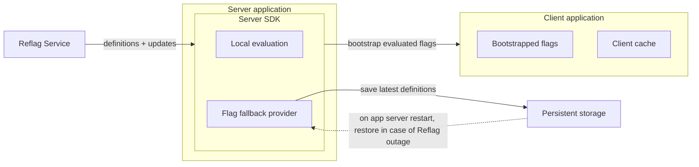

# Service Resiliency

To keep your product working even if the Reflag service is disrupted, we provide a number of safe guards and features that build on each other to provide uninterrupted service in the unlikely event of Reflag downtime.

### Local evaluation

To improve latency and provide downtime protection, our [node-sdk](../sdk/@reflag/node-sdk/) and [openfeature-node-sdk](../supported-languages/openfeature.md) perform "local evaluation" of flag rules.

With local evaluation, our SDKs will download the flag definitions from our servers and check the user and company properties against the flag rules in your application instead of contacting our servers for every evaluation. The SDK caches the downloaded list in memory, so will keep working during service disruption so long as the service that is using the SDK doesn't get rebooted. See Flag fallback providers below for how to ensure&#x20;

### Flag fallback providers

Building on local evaluation, our [node-sdk](../sdk/@reflag/node-sdk/) allows you to specify a flag fallback provider. Fallback providers automatically persist the latest successfully fetched flag definitions to fallback storage such as a local file on your servers, Redis, S3, GCS, or a custom backend.

With a flag fallback provider enabled, the [node-sdk](../sdk/@reflag/node-sdk/) follows this process when starting up:

1\. Attempt downloading fresh flag definitions from Reflag server\
2\. If successful, store the flag definitions in the fallback provider storage\
3\. Receive live updates when flags change and immediately store those too\
\
Now in the case that Reflag servers are down, in step 2 the SDK will use the fallback provider to download the latest stored flag definitions. Along with local evaluation, this ensures up to date flag definitions even if Reflag server are down.

For details on how to set it up, see the [flag fallback provider docs](../sdk/@reflag/node-sdk/#fallback-provider).

### Bootstrapped flags

With [getFlagsForBootstrap()](https://docs.reflag.com/supported-languages/node-sdk#bootstrapping-client-side-applications) in the Node SDK and [ReflagBootstrappedProvider](https://docs.reflag.com/supported-languages/react-sdk#server-side-rendering-and-bootstrapping) in the React/Vue SDKs, you can evaluate flags on the server and pass them to your client-side applications.

Bootstrapping is recommended as it means that the server has local evaluation and will pass the evaluated flags to the frontend on load, further protecting you from service disruption. The combination of local evaluation, fallback flags and bootstrapped flags means your end users will not notice in the event that Reflag servers have downtime.

### Client SDK caching

Finally, all client SDKs cache the last known flags and will keep using those in case the browser cannot reach our server.
